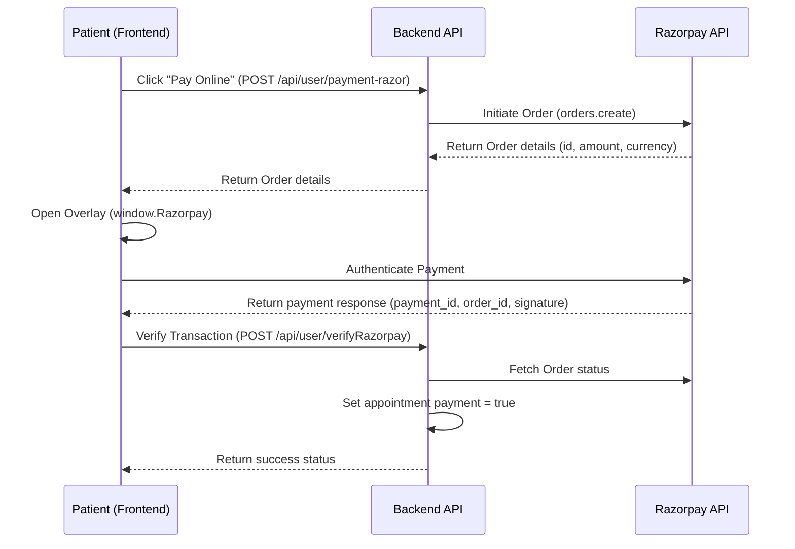

# BookMyDoc

BookMyDoc is a comprehensive MERN-stack medical appointment booking and practice management application. It features a patient portal, an admin/doctor management panel, and a unified Node.js/Express REST API.

---

## Features

### 💻 Patient Portal
- **Doctor Directory:** Browse and filter doctors by specialty.
- **Booking Calendar:** Schedule 30-minute slots for the next 7 days.
- **My Appointments:** Manage booking history, pay fees online, or cancel upcoming visits.
- **Profile Manager:** Update bio, profile photo, contact details, gender, and DOB.

### ⚙️ Admin Panel
- **Dashboard Overview:** Displays counts of doctors, appointments, and patients, plus the 5 latest bookings.
- **Add Doctor:** Register new doctor credentials, bios, fee configurations, and photos.
- **Doctors List:** View and toggle doctor availability in real-time.
- **All Appointments:** Track booking calendars, calculated patient ages, and transaction statuses.

### 🩺 Doctor Portal (API Backed)
- **Practice Dashboard:** Track total appointments, unique patients count, and earnings (completed visits).
- **Appointment Actions:** Mark bookings as completed or cancel visits (which frees calendar slots).
- **Doctor Profile:** Edit biography, fee structures, address, and availability.

### 🔒 Backend Architecture
- **JWT Authorization:** Secured role-based authentication (`atoken` for Admin, `dtoken` for Doctor, `token` for Patient).
- **Media Uploads:** Cloudinary integration for profile image hosting.
- **Payments Gateway:** Razorpay SDK integration for online fee checkouts.

---

## Technical Stack & Folders

- **Frontend / Admin (React, Vite, Tailwind CSS v4, Axios, React Router, Toastify)**
  - `/frontend` - Patient-facing appointment booking portal.
  - `/admin` - Management panel for Admins and Doctors.
- **Backend (Node.js, Express, MongoDB/Mongoose, Cloudinary, Razorpay, Multer)**
  - `/backend` - Role-secured REST API.

---

## API Routes Directory

### Admin (`/api/admin`)
- `POST /login` - Log in Admin
- `POST /add-doctor` - Add new doctor (with file upload)
- `POST /all-doctors` - Fetch all doctors list
- `POST /change-availability` - Toggle doctor availability
- `GET /appointments` - Fetch all appointments
- `POST /cancel-appointment` - Cancel an appointment
- `GET /dashboard` - Fetch admin metrics & latest queue

### User (`/api/user`)
- `POST /register` / `POST /login` - Patient sign-up & log-in
- `POST /get-profile` / `POST /update-profile` - Patient profile handlers
- `POST /book-appointment` - Register a slot with a doctor
- `GET /appointments` / `POST /cancel-appointment` - Manage user bookings
- `POST /payment-razor` / `POST /verifyRazorpay` - Online transaction integrations

### Doctor (`/api/doctor`)
- `GET /list` - Public doctor directory list
- `POST /login` - Doctor authentication
- `GET /appointments` / `GET /dashboard` - Retrieve schedules & earnings
- `POST /complete-appointment` / `POST /cancel-appointment` - Complete/Cancel appointments
- `GET /profile` / `POST /update-profile` - Edit biography details

---

## Razorpay Payment Integration

### Workflow


### Script Setup
Ensure the Razorpay script is loaded in `frontend/index.html`:
```html
<script src="https://checkout.razorpay.com/v1/checkout.js"></script>
```

---

## Setup & Installation

### 1. Backend Server Setup
Navigate to `/backend`, run `npm install`, and create a `.env` file:
```env
PORT=4000
MONGODB_URI=<MongoDB_Connection_String>
CLOUDINARY_NAME=<Cloudinary_Name>
CLOUDINARY_API_KEY=<Cloudinary_Api_Key>
CLOUDINARY_SECRET_KEY=<Cloudinary_Secret_Key>
ADMIN_EMAIL=admin@bookmydoc.com
ADMIN_PASSWORD=admin123
JWT_SECRET=<JWT_Secret_Key>
RAZORPAY_KEY_ID=<Razorpay_Key_Id>
RAZORPAY_KEY_SECRET=<Razorpay_Key_Secret>
CURRENCY=INR
```
Start server: `npm run server`

### 2. Patient Portal Setup
Navigate to `/frontend`, run `npm install`, and create a `.env` file:
```env
VITE_BACKEND_URL=http://localhost:4000
VITE_RAZORPAY_KEY_ID=<Razorpay_Key_Id>
```
Start portal: `npm run dev`

### 3. Admin Panel Setup
Navigate to `/admin`, run `npm install`, and create a `.env` file:
```env
VITE_BACKEND_URL=http://localhost:4000
```
Start panel: `npm run dev`
